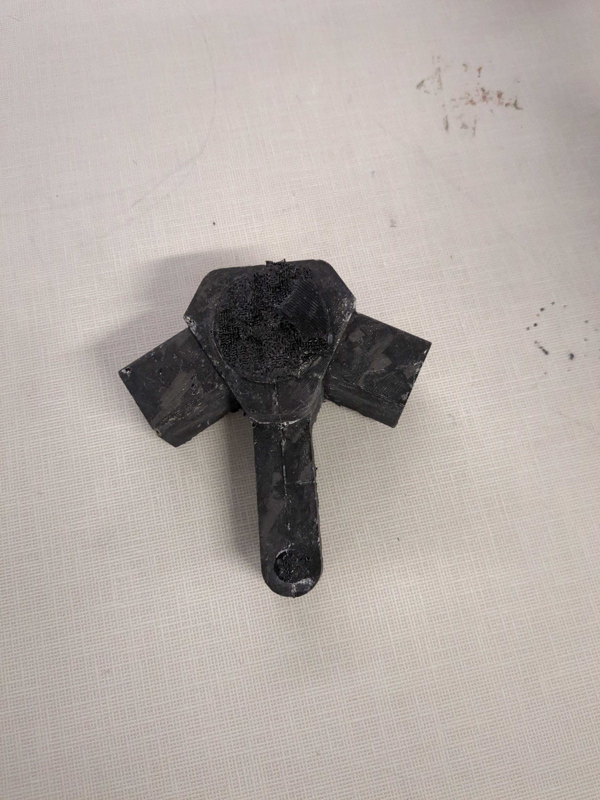
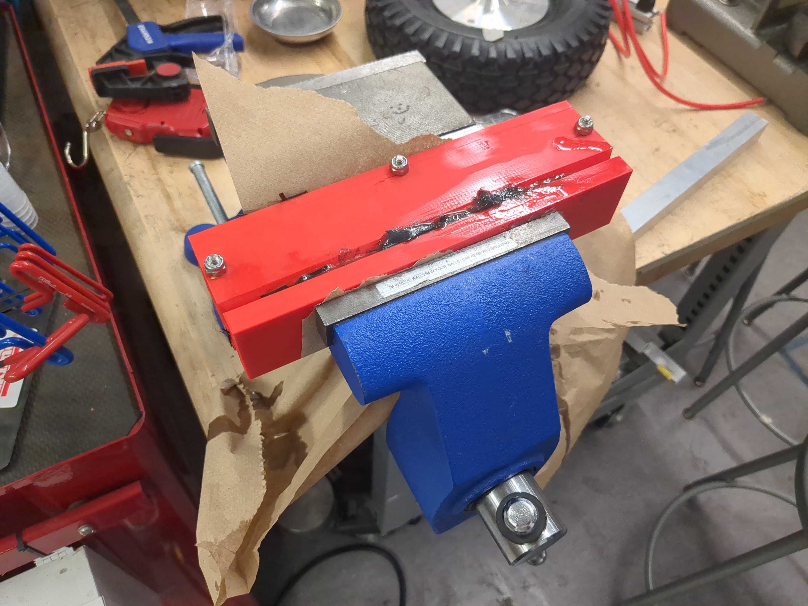

# Carbon Fiber Molding 2023 #

## Overview ##

This project was done as a part of the Cornell Mars Rover project team. Its objective was to 
create a replacement for CNC Aluminum parts out of carbon fiber. I developed a way of molding 
solid carbon fiber parts in complex geometries using 3D printed molds. 

## Molding Procces ##

The process I used is called compression molding. During the molding process, choped carbon 
is placed in the mold, and covered in epoxy resin. This is repeated over and over, until the 
carbon/epoxy mixture is equal to the mass of the desired part (as given by the CAD).

This mixture is usually much larger in volume than the part, so it must then be compressed. 
The top of the mold is pressed down into the mold over a period of around 30 min, to allow 
time for the excess epoxy in the mixture to escape. 

## Mold Design ##

As you can see from the images above, and the parts that were made from them, molds could be 
used to create increadably complex geometry, with relatively little effort. The molds I 
designed were 3D printed out of PETG. This was due to 3D printing being a very easy way to 
make the complex geometry needed in manufactoring these, and PETG was choosen for its lack 
of adhession to the epoxy I was using. The biggest drawback to using 3D printing was that 
it was very weak, and would often break during the demolding process. This meant that molds
were usually one time use. This was not a huge detriment however, as molds are very easy to 
print. This did make demolding the part the most difficult part of the process, so designing 
molds for part removal was key. Large draft angles on parts that slid past each other was
critical to limit frction between walls of the mold. I also discovered that 3 piece molds 
were much easier to take apart than 2 piece molds, as the parts no longer had to slide past
each other, but could be pulled appart. 3 piece molds also allowed more gaps for excess epoxy 
to escape, which was an added benifit.

## Testing ##

To test the yeild strength of the forged parts, I made 3 dog bone samples, and ran a tensile 
test on each one. The first test was done without the use of an extentiometer, so not strain
data was collected in order to calculate youngs modulus.

<table style="width:100%; border-collapse: collapse;">
  <tr>
    <th style="border: 1px solid #ddd; padding: 8px;">Sample</th>
    <th style="border: 1px solid #ddd; padding: 8px;">Yield Stress (psi)</th>
    <th style="border: 1px solid #ddd; padding: 8px;">Ultimate Stress (psi)</th>
    <th style="border: 1px solid #ddd; padding: 8px;">Youngs Modulus (psi)</th>
  </tr>
  <tr>
    <td style="border: 1px solid #ddd; padding: 8px;">1</td>
    <td style="border: 1px solid #ddd; padding: 8px;">12,072.31</td>
    <td style="border: 1px solid #ddd; padding: 8px;">12,072.31</td>
    <td style="border: 1px solid #ddd; padding: 8px;">No data</td>
  </tr>
  <tr>
    <td style="border: 1px solid #ddd; padding: 8px;">2</td>
    <td style="border: 1px solid #ddd; padding: 8px;">15,632.85</td>
    <td style="border: 1px solid #ddd; padding: 8px;">15,632.85</td>
    <td style="border: 1px solid #ddd; padding: 8px;">5.33 × 106</td>
  </tr>
  <tr>
    <td style="border: 1px solid #ddd; padding: 8px;">3</td>
    <td style="border: 1px solid #ddd; padding: 8px;">14,784.78</td>
    <td style="border: 1px solid #ddd; padding: 8px;">14,784.78</td>
    <td style="border: 1px solid #ddd; padding: 8px;">6.76 × 106</td>
  </tr>
</table>

