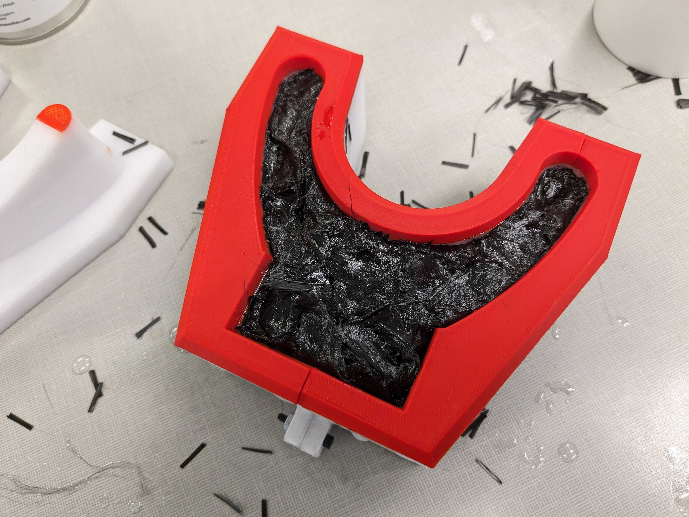

# Carbon Fiber Molding 2023 #

## Overview ##

This project was done as a part of the Cornell Mars Rover project team. Its objective was to 
create a replacement for CNC Aluminum parts out of carbon fiber. I developed a way of molding 
solid carbon fiber parts in complex geometries using 3D printed molds. 

## Molding Procces ##

The process I used is called compression molding. During the molding process, choped carbon 
is placed in the mold, and covered in epoxy resin. This is repeated over and over, until the 
carbon/epoxy mixture is equal to the mass of the desired part (as given by the CAD).

This mixture is usually much larger in volume than the part, so it must then be compressed. The top of the 
mold is pressed down into the mold over a period of around 30 min, to allow time for the 
excess epoxy in the mixture to escape. 

