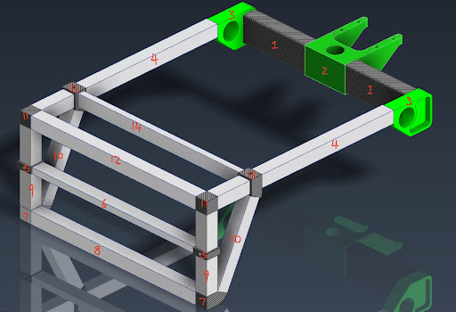

# Rover Chassis #

## Overview ##

This project was done as a part of the Cornell Mars Rover project team. 
Its objective was to create a rigid and dourable frame that would eliminate
the complex and difficult to manufacture CNC joints that had been used in 
previous years. In order to acomplish this, I taught myself sheet metal CAD 
and design, and did a full redesign of the frame in sheet metal. this was an 
ambitous departure from all previous designs, and allowed for much easier 
manufactoring, and reduction in weight, fewer overall parts, and vastly 
increased mounting space both inside and outside the frame

  

    
     
    Old Frame CAD
  

  

    
     
    Frame CAD
  

## Design Requirements ##

