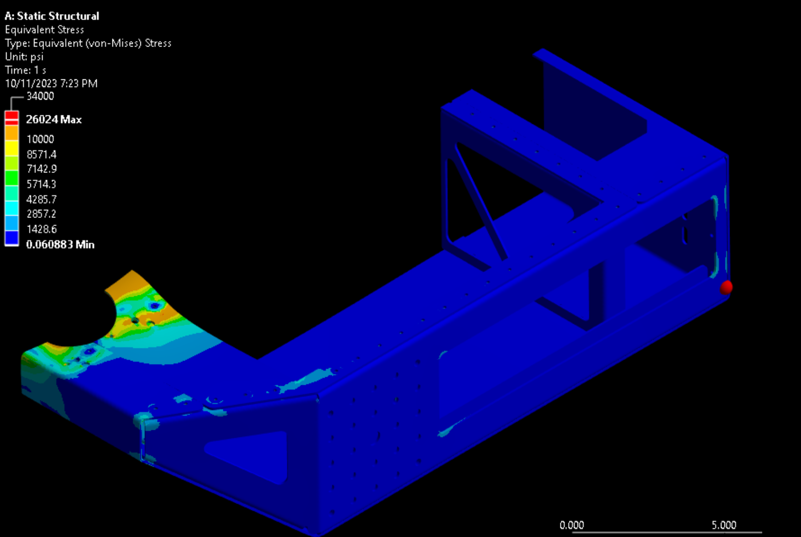

# Rover Chassis 2023 #

## Overview ##

This project was done as a part of the Cornell Mars Rover project team. 
Its objective was to create a rigid and dourable frame that would eliminate
the complex and difficult to manufacture CNC joints that had been used in 
previous years. In order to acomplish this, I taught myself sheet metal CAD 
and design, and did a full redesign of the frame in sheet metal. this was an 
ambitous departure from all previous designs, and allowed for much easier 
manufactoring, and reduction in weight, fewer overall parts, and vastly 
increased mounting space both inside and outside the frame. 

On the left is the old design, and on the right my updated design in sheet 
metal.

  
  

## Design Requirements ##

<ol>
    <li>Suspension mounts must be able to hold up the weight of the rover, which interfaces at two 0.5in shoulder bolts (value 30kg total)</li>
    <li>The arm mount must withstand the loading from the arm, carrying a 5kg weight at full extension. (value 90Nm)</li>
    <li>Provide an enclosed space for electronics that allows for easy removal of the electrical core.</li>
    <li>Provide integrated panel mounts to run wiring to different parts of the rover.</li>
    <li>Provide mounting for the onboard lab.</li>
    <li>Provide mounting for cameras.</li>
</ol>

## Design ##

This assembly consists of seven parts, made out of bent 9 gauge aluminum. Key mounting points, such as for the arm and suspension, are reinforced with quarter inch plates, which surve two key purposes: dispersing the high local loads from the mounting screws over a larger surface area to prevent high stress concentration in the weaker sheet metal, and to facilitate easy mounting by providing a place for screws to thread into. Internal plates also reinforce the frame from the inside. The center of the frame where the arm is mounted acts similar to a simply supported beam. Two supports connect the top and bottom of the frame to rienforce the center, preventing that "beam" from bending under the high loading conditions from the arm. A third reinforcement plate connects the two sides of the frame together down the middle, helping to resist any torsional loads coming from the suspension during climbing. 

## Analysis ##

## Testing and Opperation ##

